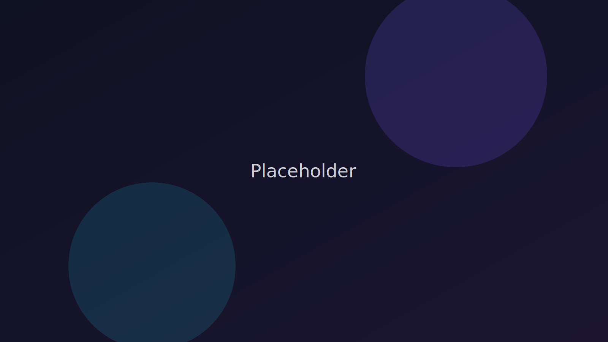

# Заголовок раздела

Это абзац с обычным текстом. Поддерживаются **жирный** и *курсив*.

## Подзаголовок

- Список 1
- Список 2

Ссылка: [Главная](/index.html).

Код:

```
console.log('Hello from markdown');
```

Картинка:




